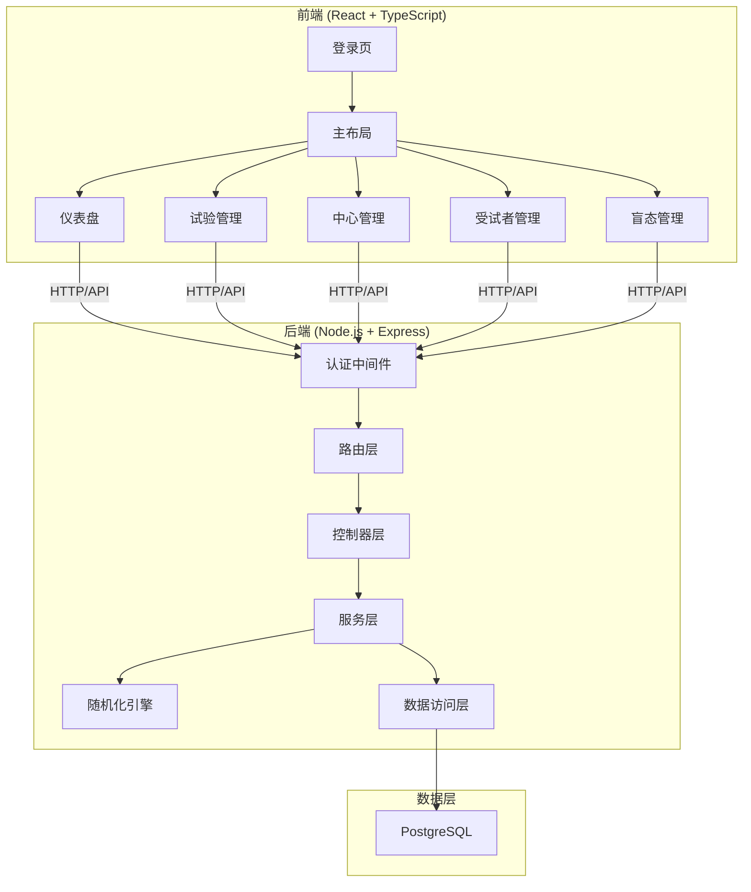
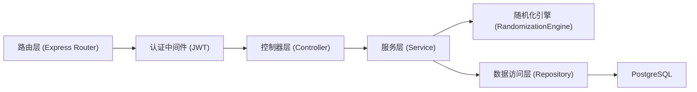
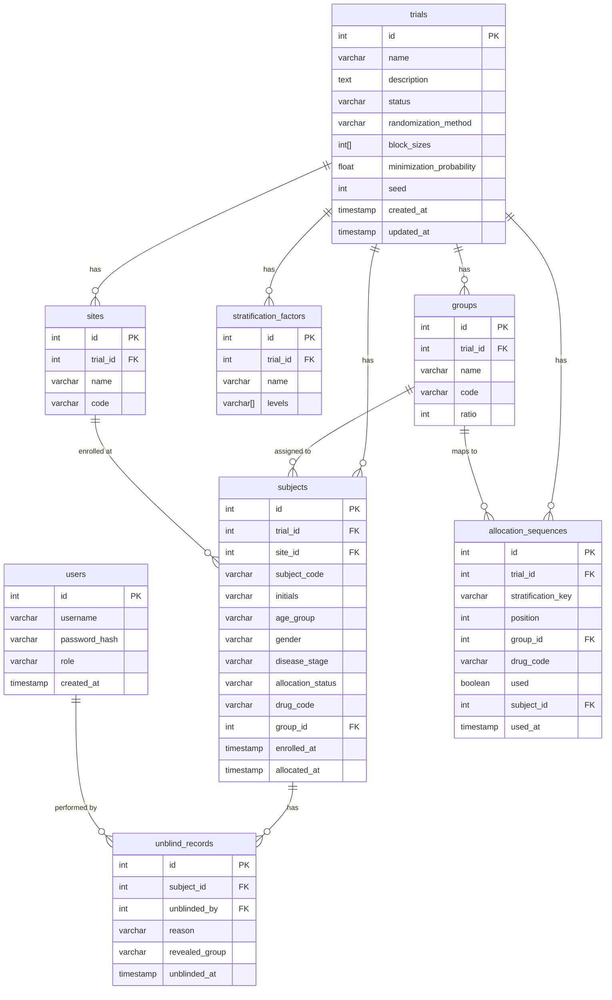

## 1. 架构设计



## 2. 技术说明

- 前端：React@18 + TypeScript + TailwindCSS@3 + Vite + Zustand + Recharts
- 初始化工具：vite-init (react-express-ts 模板)
- 后端：Express@4 + TypeScript (ESM)
- 数据库：PostgreSQL 15
- 图表库：Recharts（入组趋势、平衡度可视化）
- 随机化引擎：独立模块，可插拔算法
- 容器化：Docker Compose (前端 + 后端 + PostgreSQL)

## 3. 路由定义

| 路由 | 用途 |
|------|------|
| `/login` | 管理员登录 |
| `/` | 仪表盘（入组概览、趋势、平衡度） |
| `/trials` | 试验项目列表 |
| `/trials/:id` | 试验详情（组别、分层、区组配置） |
| `/sites` | 研究中心管理 |
| `/subjects` | 受试者列表与管理 |
| `/blinding` | 盲态管理与揭盲记录 |

## 4. API定义

### 4.1 认证

```
POST   /api/auth/login          { username, password } → { token, user }
GET    /api/auth/me             → { user }
```

### 4.2 试验项目

```
GET    /api/trials              → Trial[]
POST   /api/trials              { name, description, status, randomizationMethod, blockSizes[], stratificationFactors[] } → Trial
GET    /api/trials/:id          → Trial
PUT    /api/trials/:id          → Trial
DELETE /api/trials/:id          → void
```

### 4.3 组别

```
GET    /api/trials/:id/groups   → Group[]
POST   /api/trials/:id/groups   { name, ratio, code } → Group
PUT    /api/groups/:id          → Group
DELETE /api/groups/:id          → void
```

### 4.4 研究中心

```
GET    /api/sites               → Site[]
POST   /api/sites               { name, code, trialId } → Site
PUT    /api/sites/:id           → Site
DELETE /api/sites/:id           → void
```

### 4.5 受试者

```
GET    /api/subjects            → Subject[]
POST   /api/subjects            { trialId, siteId, initials, ageGroup, gender, diseaseStage, ... } → Subject
GET    /api/subjects/:id        → Subject
PUT    /api/subjects/:id        → Subject
DELETE /api/subjects/:id        → void
POST   /api/subjects/:id/allocate → { drugCode, groupAssigned(仅揭盲后可见) }
```

### 4.6 随机化

```
GET    /api/randomization/sequences/:trialId   → AllocationSequence[]
POST   /api/randomization/generate/:trialId    { seed? } → { sequences }
```

### 4.7 揭盲

```
POST   /api/unblind             { subjectId, reason } → { groupAssigned }
GET    /api/unblind/records     → UnblindRecord[]
```

### 4.8 看板统计

```
GET    /api/dashboard/overview/:trialId    → { total, byGroup[], bySite[], enrollmentRate }
GET    /api/dashboard/trend/:trialId       → { date, count }[]
GET    /api/dashboard/balance/:trialId     → { factor, groupDistribution[] }[]
```

## 5. 服务端架构图



## 6. 数据模型

### 6.1 数据模型定义



### 6.2 数据定义语言

```sql
CREATE TABLE users (
    id SERIAL PRIMARY KEY,
    username VARCHAR(100) NOT NULL UNIQUE,
    password_hash VARCHAR(255) NOT NULL,
    role VARCHAR(50) NOT NULL DEFAULT 'admin',
    created_at TIMESTAMP DEFAULT CURRENT_TIMESTAMP
);

CREATE TABLE trials (
    id SERIAL PRIMARY KEY,
    name VARCHAR(255) NOT NULL,
    description TEXT,
    status VARCHAR(50) NOT NULL DEFAULT 'active',
    randomization_method VARCHAR(50) NOT NULL DEFAULT 'stratified_block',
    block_sizes INTEGER[] NOT NULL DEFAULT '{4,6}',
    minimization_probability NUMERIC(3,2) NOT NULL DEFAULT 0.70,
    seed INTEGER NOT NULL DEFAULT 42,
    created_at TIMESTAMP DEFAULT CURRENT_TIMESTAMP,
    updated_at TIMESTAMP DEFAULT CURRENT_TIMESTAMP
);

CREATE TABLE groups (
    id SERIAL PRIMARY KEY,
    trial_id INTEGER NOT NULL REFERENCES trials(id) ON DELETE CASCADE,
    name VARCHAR(100) NOT NULL,
    code VARCHAR(50) NOT NULL,
    ratio INTEGER NOT NULL DEFAULT 1
);

CREATE TABLE stratification_factors (
    id SERIAL PRIMARY KEY,
    trial_id INTEGER NOT NULL REFERENCES trials(id) ON DELETE CASCADE,
    name VARCHAR(100) NOT NULL,
    levels TEXT[] NOT NULL
);

CREATE TABLE sites (
    id SERIAL PRIMARY KEY,
    trial_id INTEGER NOT NULL REFERENCES trials(id) ON DELETE CASCADE,
    name VARCHAR(255) NOT NULL,
    code VARCHAR(50) NOT NULL
);

CREATE TABLE subjects (
    id SERIAL PRIMARY KEY,
    trial_id INTEGER NOT NULL REFERENCES trials(id) ON DELETE CASCADE,
    site_id INTEGER NOT NULL REFERENCES sites(id) ON DELETE CASCADE,
    subject_code VARCHAR(100) NOT NULL UNIQUE,
    initials VARCHAR(10),
    age_group VARCHAR(50),
    gender VARCHAR(20),
    disease_stage VARCHAR(50),
    allocation_status VARCHAR(50) NOT NULL DEFAULT 'pending',
    drug_code VARCHAR(100),
    group_id INTEGER REFERENCES groups(id),
    enrolled_at TIMESTAMP DEFAULT CURRENT_TIMESTAMP,
    allocated_at TIMESTAMP
);

CREATE TABLE allocation_sequences (
    id SERIAL PRIMARY KEY,
    trial_id INTEGER NOT NULL REFERENCES trials(id) ON DELETE CASCADE,
    stratification_key VARCHAR(255) NOT NULL,
    position INTEGER NOT NULL,
    group_id INTEGER NOT NULL REFERENCES groups(id),
    drug_code VARCHAR(100) NOT NULL,
    used BOOLEAN NOT NULL DEFAULT FALSE,
    subject_id INTEGER REFERENCES subjects(id),
    used_at TIMESTAMP
);

CREATE TABLE unblind_records (
    id SERIAL PRIMARY KEY,
    subject_id INTEGER NOT NULL REFERENCES subjects(id) ON DELETE CASCADE,
    unblinded_by INTEGER NOT NULL REFERENCES users(id),
    reason TEXT NOT NULL,
    revealed_group VARCHAR(100) NOT NULL,
    unblinded_at TIMESTAMP DEFAULT CURRENT_TIMESTAMP
);

CREATE INDEX idx_subjects_trial ON subjects(trial_id);
CREATE INDEX idx_subjects_site ON subjects(site_id);
CREATE INDEX idx_subjects_status ON subjects(allocation_status);
CREATE INDEX idx_allocation_seq_trial ON allocation_sequences(trial_id);
CREATE INDEX idx_allocation_seq_strat ON allocation_sequences(stratification_key, position);
CREATE INDEX idx_allocation_seq_used ON allocation_sequences(used);
CREATE INDEX idx_unblind_subject ON unblind_records(subject_id);
```
